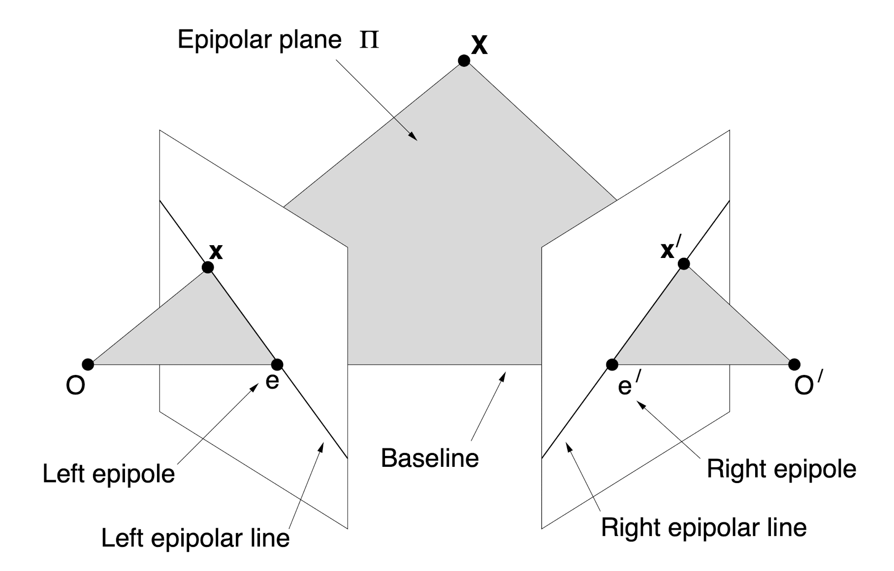
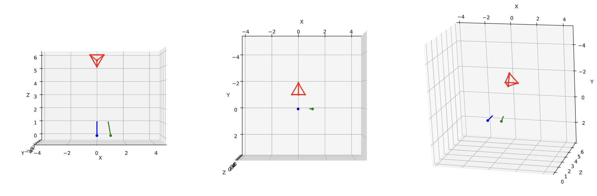
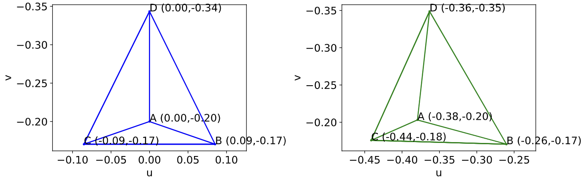
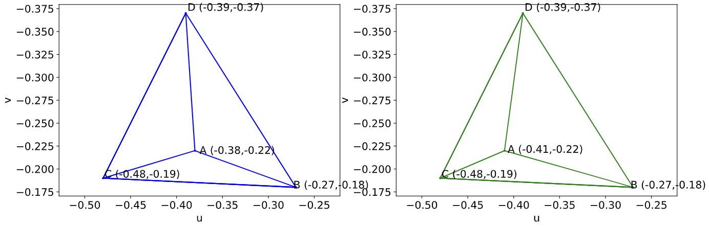

# Stereo Rectification of Synthetic Images of Tetrahedrons

## Epipoles
The epipolar plane is defined by the optical centers of the two cameras and a three-dimensional point, e.g. our correspondence points in the real world. The intersection of the epipolar plane with the respective image planes of the cameras is coined epipolar line. The intersections between the baseline and the image planes are coined epipoles.

The epipolar constraint constrains corresponding points on the image plane of one image to a line, the epipolar line, on the other image plane.

## Stereo Rectification

In __stereo rectification__, we want to find and apply homographies to two images of distinct perspectives so that all epipolar lines of the transformed images are parallel to the horizontal axis, i.e. the epipoles lie in infinity, and their corresponding keypoints lie on the same vertical coordinate. Matching corresponding keypoints is more efficient with stereo-rectified images: Given a keypoint in one image, the corresponding keypoint can be found on the horizontal line at the same vertical coordinate as the given keypoint, saving the computational cost of searching for the corresponding keypoint in the whole image. To compute how far a keypoint moved between images, the corresponding keypoint must be found first. A keypoint that is very far away will move less from one perspective to the other than a very close object. The resulting disparity map gives depth information about regions in the image, which can be used to project virtual objects into the image in augmented reality. The depth information can also be used to reconstruct 3D objects from the images.

### Camera Setup
We perform stereo rectification with a simplified example. We set up two artificial cameras and a regular tetrahedron.

To calculate the homographies $H_1$ and $H_2$ that rectify the images of $C_1$ and $C_2$, we need to find the epipoles $e_1$ and $e_2$ and set them to infinity. We will first explore the projection of $T$ onto the image planes of $C_1$ and $C_2$. $C_1$'s rigid body transformation $P_r$ is the identity matrix. $C_2$'s rigid body transformation is

$$P_r = 
    \begin{bmatrix}
    0.985 & 0 & -0.174 & -1\\
    0 & 1 & 0 & 0\\
    0.174 & 0 & 0.985 & 0\\
    0 & 0 & 0 & 1
    \end{bmatrix}.$$

We set the focal length $f=1$ for both cameras, yielding the perspective projection

$$P_p = 
    \begin{bmatrix}
    1 & 0 & 0 & 0\\
    0 & 1 & 0 & 0\\
    0 & 0 & 1 & 0
    \end{bmatrix}.$$

We set the origin of the pixels to the centre of the image plane and use the natural pixel scale of the world coordinates for $C_1$ and $C_2$ to simplify computations, i.e. setting the CCD calibration matrix $P_c$ to the identity matrix:

$$P_c = 
    \begin{bmatrix}
    1 & 0 & 0 \\
    0 & 1 & 0 \\
    0 & 0 & 1 
    \end{bmatrix}$$
    
We compute the projection of $T$ onto the image planes of $C_1$ and $C_2$ with

$$\begin{bmatrix}
    su \\
    sv \\
    s
\end{bmatrix}_{A,B,C,D} =
P_c P_p P_r T_{A,B,C,D}$$

and plot the tetrahedons, projected on the image plain of the cameras.

We set up $C_1$ so that $e_1$ is already in infinity.
We can compute $e_2$ from the fundamental matrix $F=K^{\prime-T}EK^{-1}$.
In our setup, $F$ is given by the essential matrix $E = T_{\times}R$, as we have set up $K$ to be the identity matrix:

$$K =
\begin{bmatrix}
    fk_{u} & 0 & u_{0} \\
    0 & fk_{v} & v_{0} \\
    0 & 0 & 1 
\end{bmatrix}
=
\begin{bmatrix}
    1 & 0 & 0 \\
    0 & 1 & 0 \\
    0 & 0 & 1 
\end{bmatrix}.$$

We get

$$T_{\times} = 
\begin{bmatrix}
    0 & 0 & 0 \\
    0 & 0 & 1 \\
    0 & -1 & 0 
\end{bmatrix}$$

and 

$$R = 
\begin{bmatrix}
    0.985 & 0 & -0.174\\
    0 & 1 & 0 & 0\\
    0.174 & 0 & 0.985\\
\end{bmatrix}$$

from $P_r$ and compute $E$:

$$E = 
\begin{bmatrix}
    0 & 0 & 0 \\
    0.174 & 0 & 0.985\\
    0 & -1 & 0\\
\end{bmatrix}.$$

By the epipolar constraint, we get $Fe_2 = Ee_2 = 0$, and we see that $e_2$ is the right null vector of $E$:

$$\operatorname{SVD}(E) =
U,S,
\begin{bmatrix}
    0 & -1 & 0 \\
    -0.17 & 0 & -0.98\\
    -0.98 & 0 & 0.17\\
\end{bmatrix}$$

$$e_2 = 
\begin{bmatrix}
    -0.98 \\
    0\\
    0.17\\
\end{bmatrix}
\cdot \frac{1}{0.17}
=
\begin{bmatrix}
    -5.67 \\
    0\\
    1\\
\end{bmatrix}.$$

We plot $e_2$ on the image plane of $C_2$.

Now we want to derive the homography $H_2$ that maps $e_2$ to infinity. First, we map $e_2$ to a point on the horizontal axis $(f,0,1)$. We notice that by the camera setup, $e_2$ fulfils this property already. We see that mapping $e_2$ to infinity is accomplished by the transformation $G$:

$$G = 
\begin{bmatrix}
    1 & 0 & 0 \\
    0 & 1 & 0\\
    -1/-5.67 & 0 & 1\\
\end{bmatrix},$$

so we get $H_2 = G$. Finally, we find $H_1$ by minimising the sum of square distances of corresponding points of the transformed images:

$$\begin{split}
H_1^* &= 
\argmin_{H_1} \sum_i ||H_1p_{1i}-H_2p_{2i}||^2 \\
H_1^* &= 
\begin{bmatrix}
    0.985 & 0.079 & -0.331 \\
    0.00 & 1.00 & 0.00\\
    0.347 & 0.01 & 0.926\\
\end{bmatrix}.
\end{split}$$

We apply $H_1$ and $H_2$ to our projections and plot our results.

The images shows stereo rectified projections of $T$ onto $C_1$ (left) and $C_2$ (right). In $C_1$, $T$ has the pixel coordinates $T_A=(-0.38,-0.22)$, $T_B=(-0.27,-0.18)$, $T_C=(-0.48,-0.19)$ and $T_D=(-0.39,-0.37)$. In $C_2$, the pixel coordinates of $T$ are $T_A=(-0.41,-0.22)$, $T_B=(-0.27,-0.18)$, $T_C=(-0.48,-0.19)$ and $T_D=(-0.39,-0.37)$. We notice that the corresponding points are now on the same horizontal line.